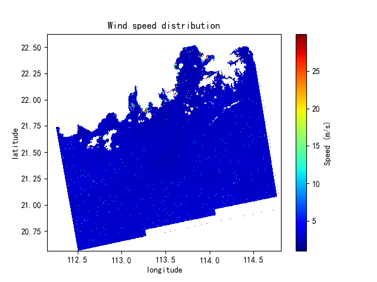

# 基于SAR的近海风能评估
大创 “基于SAR的近海风能评估” 项目文件  
## 项目简介
使用C波段SAR卫星数据进行风场反演。  
支持四种反演模型：CMOD_FIR2、CMOD4、CMOD5、CMOD5_N。
## 项目结构
    SAR/
    ├── src/
    │   ├── __init__.py     
    │   ├── filter.py       # 滤波器
    │   └── func.py         # 主要函数
    ├── model/
    │   ├── __init__.py 
    │   └── CMOD.py         # CMOD模型
    ├── main.py             # 主运行文件
    ├── README.md            
    └── requirements.txt    # 环境配置文件

## 下载安装
    git clone https://github.com/AGUSYSU/SAR.git
## 环境要求
python==3.9  
依赖库详见requirements.txt

## 使用
运行main.py即可。  
修改原始数据（tif文件）路径，根据需求适当添加函数。

## 效果展示
以下图片为不同反演模型对苏拉台风(SAOLA, 2023.08.28)Sentinel-1卫星检测数据的反演风速图。  
使用反演模型依次为:  
左上CMOD-FIR2，右上CMOD4，左下CMOD5，右下CMOD5_N。

|  |  |
|------------------------|------------------------|
|  |  |

